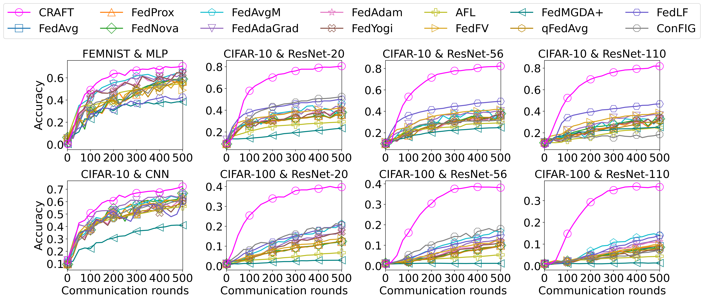

<h1 align="center">CRAFT: Conflict-Resolved Aggregation for <br/> Federated Training</h1>

<h4 align="center"><a href="https://iziqi.github.io/">Ziqi Wang</a>, <a href="https://qiauil.github.io/">Qiang Liu</a>, and <a href="https://ge.in.tum.de/about/n-thuerey/">Nils Thuerey</a></h4>

<p align="center">
  <a href="https://arxiv.org/abs/2605.21317">
    
  </a>
</p>

<p align="center">
  
</p>

## Overview

This repository implements **CRAFT**, a federated learning framework designed for robust global aggregation under heterogeneous client data distributions. The current training pipeline supports CRAFT as the server-side aggregation algorithm and integrates configurable client sampling, local training, data partitioning, evaluation, and result logging. For more details, please refer to our **[paper](https://arxiv.org/abs/2605.21317)**.

## Repository structure

```text
.
├── main_train.py          # Training entry point
├── fed/
│   ├── craft.py           # CRAFT aggregation
│   ├── server.py          # Federated server
│   ├── client.py          # Federated client
│   ├── federate.py        # Federated training loop
│   ├── dataset.py         # Dataset loading and partitioning
│   └── nets.py            # Model definitions
├── utils/
│   ├── args.py            # CLI argument parsing
│   ├── config.yaml        # Experiment configuration
│   └── utils.py           # Shared utilities
├── dataset/               # Dataset files and assets
├── results/               # Result analysis utilities 
```
  
## Usage

Run a single CRAFT experiment using the YAML configuration:

```bash
python main_train.py --cfg utils/config.yaml
```

## Citation

If this code is useful for your research, please cite the paper:

```bibtex
@article{wang2026CRAFT,
  author={Ziqi Wang and Qiang Liu and Nils Thuerey},
  title={CRAFT: Conflict-Resolved Aggregation for Federated Training}, 
  eprint={2605.21317},
  archivePrefix={arXiv},
  url={https://arxiv.org/abs/2605.21317}, 
}
```

## Acknowledgments

Funded by the European Union's Horizon Europe MSCA project [ModConFlex](https://modconflex.uni-wuppertal.de/en/) (grant number 101073558)

 
